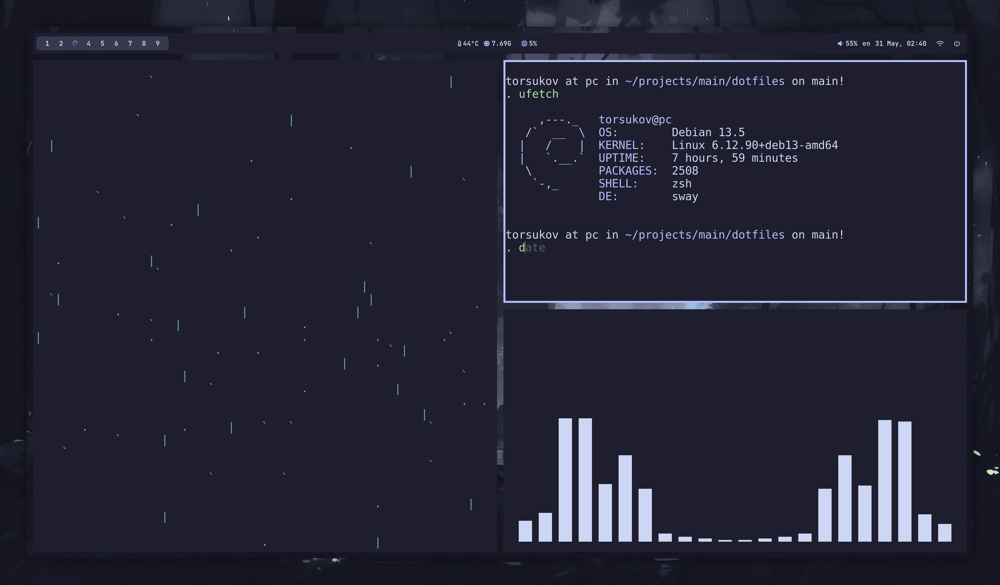
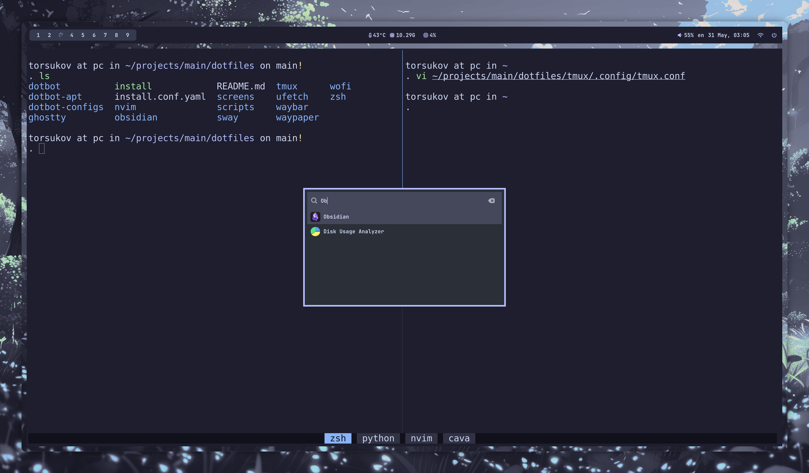
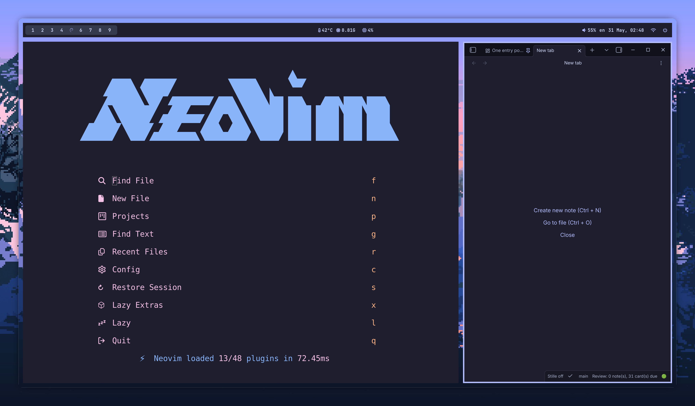
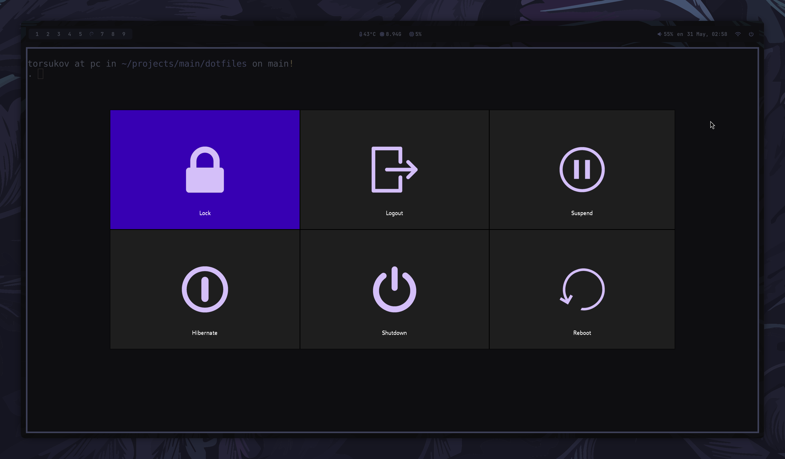

I wanted a Debian setup that is simple, stable and nice to look at. If you are looking for something similar, maybe you will find something useful here

| ⚠️ Attention |
|-------------|
| These dotfiles reflect my personal workflow and preferences. You are welcome to use them, but please do so at your own discretion. If you find any issues, please report them |


## Showcase



  

  



## Installation on a fresh Debian 13

```bash
git clone --recurse-submodules git@github.com:atrskv/dotfiles.git ~/projects/main/dotfiles
cd ~/projects/main/dotfiles
chmod +x install
./install
```

If the repository was already cloned without submodules:

```bash
git submodule update --init --recursive
```

## Apply configs only

To restore symlinks without running the full installation, run Dotbot directly:

```bash
dotbot/bin/dotbot -d "$PWD" -c install.conf.yaml
```

This is useful if the programs are already installed and you just need to relink the configs 

##### Also each layer can be run individually: 

```bash
sudo dotbot/bin/dotbot -d "$PWD" -p dotbot-apt/apt.py -c dotbot-configs/packages.conf.yaml
```


```bash
dotbot/bin/dotbot -d "$PWD" -c dotbot-configs/flatpak.conf.yaml
```

...


<p align="center">
Special thanks to <a href="https://github.com/Zproger/bspwm-dotfiles">Zproger/bspwm-dotfiles</a> for the inspiration
</p>


